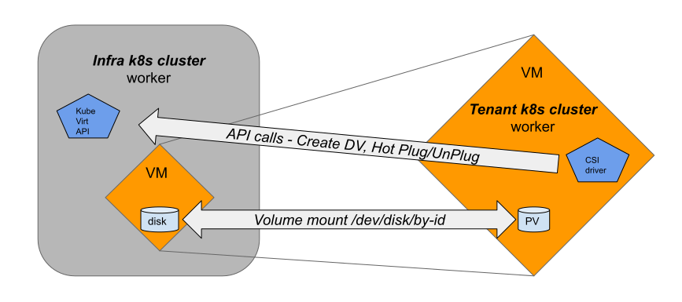

# CSI KubeVirt Driver

This repository hosts the CSI KubeVirt driver and all of its build and dependent configuration files to deploy the driver.

This CSI driver is made for a tenant cluster deployed on top of kubevirt VMs, and enables it to get its persistent data  
from the underlying, infrastructure cluster.
To avoid confusion, this CSI driver is deployed on the tenant cluster, and does not require kubevirt installation at all.

The term "tenant cluster" refers to the k8s cluster installed on kubevirt VMs, and "infrastructure cluster"  
(or shorter "infra cluster") refers to a cluster with kubevirt installed and can be installaed on any infrastrucure (baremetal, public cloud, etc).



## Pre-requisite
- Kubernetes cluster
- Running version 1.18 or later
- Access to terminal with `kubectl` installed

## Deployment
//TODO WIP
- use `deploy/infra-cluster-service-account.yaml` to create a service account in kubevirt cluster (use '-n' flag in create command for specifying the kubevirt cluster namespace)
- create kubeconfig for service account
    - Run `./hack/create-infra-kubeconfig.sh > temp_kubeconfig.yaml`  
    - Test your kubeconfig. Try listing resources of type VMI in the kubevirt cluster namespace.
    - This kubeconfig is configured with server url accessible from local machine `127.0.0.1:[0-9]+`, to use it in tenant 
  cluster the url has to changed to that of a VM: `sed -i -r 's/127.0.0.1:[0-9]+/192.168.66.101:6443/g' temp_kubeconfig.yaml`

- create namespace for the driver in tenant cluster
    - Use `deploy/000-namespace.yaml`
- use `deploy/secret.yaml` for creating the necessary secret in the tenant cluster
    - set kubeconfig: [base64 of kubeconfig from previous step]
- use `deploy/configmap.yaml` for creating the driver's config
    - set infraClusterNamespace to the kubevirt cluster namespace.
    - set infraClusterLabels. The format is 'key=value,key=value,...'. The driver creates resources in the infra cluster. These resources are labeled with the values you supply in infraClusterLabels. Provide values that make the labels unique to your cluster. One usage of such labels is for destroying the tenant cluster. The labels tells us what resources were created in the infra cluster for serving the tenant.
- deploy files under `deploy` in  tenant cluster
    - 000-csi-driver.yaml
    - 020-authorization.yaml
    - 030-node.yaml
    - 040-controller.yaml
- create StorageClass and PersistentVolumeClaim - see `deploy/example`
- Enable HotplugVolumes feature gate
    - In case your Kubevirt namespace has the ConfigMap 'kubevirt-config' then use `deploy/example/kubevirt-config.yaml` for adding the feature gate to it. Look at the path {.data.feature-gates}
    - Otherwise, add the feature gate to the resource of type Kubevirt. There should be a single resource of this type and its name is irrelevant. See `deploy/example/kubevirt.yaml`
    - Pay attention that in some deployments there are operators that will restore previous configuration. You will have to stop these operators for editing the resources.Some operators allow configuration through their own CRD. HCO is such an operator. See [HCO cluster configuration](https://github.com/kubevirt/hyperconverged-cluster-operator/blob/master/docs/cluster-configuration.md) to understand how HCO feature gates are configured.

## Examples

## Building the binaries

If you want to build the driver yourself, you can do so with the following command from the root directory:

```shell
make build
```

## Run functional tests

Running the functional tests will use an existing cluster (looks for `KUBECONFIG`) to deploy a tenant k8s cluster 
and will deploy the CSI driver on it, and a test pod that consumes a dynamically provisioned volume.

```shell
make test-functional IMG=quay.io/kubevirt/csi-driver:latest
```

You can choose to run the tests on a specific namespace. That namespace will not be terminated in the end of the run.
```shell
KUBEVIRT_CSI_DRIVER_FUNC_TEST_NAMESPACE=my-namespace make test-functional
```
## Submitting patches

When sending patches to the project, the submitter is required to certify that
they have the legal right to submit the code. This is achieved by adding a line

    Signed-off-by: Real Name <email@address.com>

to the bottom of every commit message. Existence of such a line certifies
that the submitter has complied with the Developer's Certificate of Origin 1.1,
(as defined in the file docs/developer-certificate-of-origin).

This line can be automatically added to a commit in the correct format, by
using the '-s' option to 'git commit'.

# Community

If you got enough of code and want to speak to people, then you got a couple
of options:

* Chat with us on Slack via [#virtualization @ kubernetes.slack.com](https://kubernetes.slack.com/?redir=%2Farchives%2FC8ED7RKFE)
* Discuss with us on the [kubevirt-dev Google Group](https://groups.google.com/forum/#!forum/kubevirt-dev)

### Code of conduct

[Code of conduct](CODE_OF_CONDUCT.md)

## License

KubeVirt CSI Driver is distributed under the
[Apache License, Version 2.0](http://www.apache.org/licenses/LICENSE-2.0.txt).

    Copyright 2016

    Licensed under the Apache License, Version 2.0 (the "License");
    you may not use this file except in compliance with the License.
    You may obtain a copy of the License at

        http://www.apache.org/licenses/LICENSE-2.0

    Unless required by applicable law or agreed to in writing, software
    distributed under the License is distributed on an "AS IS" BASIS,
    WITHOUT WARRANTIES OR CONDITIONS OF ANY KIND, either express or implied.
    See the License for the specific language governing permissions and
    limitations under the License.
